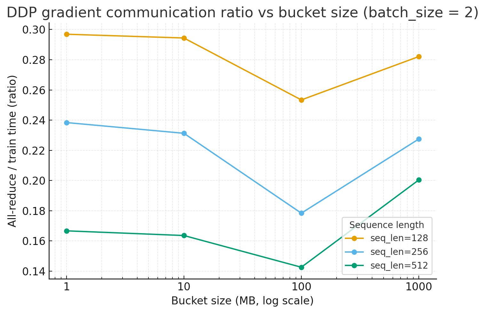

# Problem (ddp_bucketed_benchmarking)

## Question (a) 

> Benchmark your bucketed DDP implementation using the same config as the previous experiments
> (1 node, 2 GPUs, XL model size), varying the maximum bucket size (1, 10, 100, 1000 MB).
> Compare your results to the previous experiments without bucketing—do the results align with
> your expectations? If they don’t align, why not? You may have to use the PyTorch profiler as
> necessary to better understand how communication calls are ordered and/or executed. What
> changes in the experimental setup would you expect to yield results that are aligned with your
> expectations?

How to run the script:
```bash
uv run cs336_systems/benchmarking_scripts/ddp_bucketed_benchmarking.py
```

### Deliverable

> Measured time per training iteration for various bucket sizes. 3-4 sentence commentary about the results, your expectations, and potential reasons for any mismatch.

Conclusion: There is a sweetspot for bucket size: ~100MB. If bucket is too small, we're communicating too often. If we set bucket size 1000MB, we're not overlapping communication and computation enough.

#### Batch size 2

```bash 
Training DDP model, local_bs: 2, seq_len: 128, bucket_size_mb: 1
total time train: tensor([0.7293], device='cuda:0')
total time grad all reduce: tensor([0.2165], device='cuda:0')
ratio grad all reduce to train time: tensor([0.2969], device='cuda:0')
Training DDP model, local_bs: 2, seq_len: 128, bucket_size_mb: 10
total time train: tensor([0.7290], device='cuda:0')
total time grad all reduce: tensor([0.2146], device='cuda:0')
ratio grad all reduce to train time: tensor([0.2944], device='cuda:0')
Training DDP model, local_bs: 2, seq_len: 128, bucket_size_mb: 100
total time train: tensor([0.7092], device='cuda:0')
total time grad all reduce: tensor([0.1797], device='cuda:0')
ratio grad all reduce to train time: tensor([0.2534], device='cuda:0')
Training DDP model, local_bs: 2, seq_len: 128, bucket_size_mb: 1000
total time train: tensor([0.7124], device='cuda:0')
total time grad all reduce: tensor([0.2009], device='cuda:0')
ratio grad all reduce to train time: tensor([0.2821], device='cuda:0')
Training DDP model, local_bs: 2, seq_len: 256, bucket_size_mb: 1
total time train: tensor([0.7375], device='cuda:0')
total time grad all reduce: tensor([0.1758], device='cuda:0')
ratio grad all reduce to train time: tensor([0.2384], device='cuda:0')
Training DDP model, local_bs: 2, seq_len: 256, bucket_size_mb: 10
total time train: tensor([0.7335], device='cuda:0')
total time grad all reduce: tensor([0.1697], device='cuda:0')
ratio grad all reduce to train time: tensor([0.2313], device='cuda:0')
Training DDP model, local_bs: 2, seq_len: 256, bucket_size_mb: 100
total time train: tensor([0.7191], device='cuda:0')
total time grad all reduce: tensor([0.1283], device='cuda:0')
ratio grad all reduce to train time: tensor([0.1784], device='cuda:0')
Training DDP model, local_bs: 2, seq_len: 256, bucket_size_mb: 1000
total time train: tensor([0.7193], device='cuda:0')
total time grad all reduce: tensor([0.1636], device='cuda:0')
ratio grad all reduce to train time: tensor([0.2275], device='cuda:0')
Training DDP model, local_bs: 2, seq_len: 512, bucket_size_mb: 1
total time train: tensor([0.7870], device='cuda:0')
total time grad all reduce: tensor([0.1283], device='cuda:0')
ratio grad all reduce to train time: tensor([0.1630], device='cuda:0')
Training DDP model, local_bs: 2, seq_len: 512, bucket_size_mb: 10
total time train: tensor([0.7857], device='cuda:0')
total time grad all reduce: tensor([0.1200], device='cuda:0')
ratio grad all reduce to train time: tensor([0.1527], device='cuda:0')
Training DDP model, local_bs: 2, seq_len: 512, bucket_size_mb: 100
total time train: tensor([0.7713], device='cuda:0')
total time grad all reduce: tensor([0.1306], device='cuda:0')
ratio grad all reduce to train time: tensor([0.1693], device='cuda:0')
Training DDP model, local_bs: 2, seq_len: 512, bucket_size_mb: 1000
total time train: tensor([0.7819], device='cuda:0')
total time grad all reduce: tensor([0.1518], device='cuda:0')
ratio grad all reduce to train time: tensor([0.1941], device='cuda:0')
```

#### Batch size 4

```bash 
Training DDP model, local_bs: 4, seq_len: 128, bucket_size_mb: 1
total time train: tensor([0.7359], device='cuda:0')
total time grad all reduce: tensor([0.1778], device='cuda:0')
ratio grad all reduce to train time: tensor([0.2416], device='cuda:0')
Training DDP model, local_bs: 4, seq_len: 128, bucket_size_mb: 10
total time train: tensor([0.7367], device='cuda:0')
total time grad all reduce: tensor([0.1779], device='cuda:0')
ratio grad all reduce to train time: tensor([0.2414], device='cuda:0')
Training DDP model, local_bs: 4, seq_len: 128, bucket_size_mb: 100
total time train: tensor([0.7197], device='cuda:0')
total time grad all reduce: tensor([0.1243], device='cuda:0')
ratio grad all reduce to train time: tensor([0.1727], device='cuda:0')
Training DDP model, local_bs: 4, seq_len: 128, bucket_size_mb: 1000
total time train: tensor([0.7136], device='cuda:0')
total time grad all reduce: tensor([0.1529], device='cuda:0')
ratio grad all reduce to train time: tensor([0.2143], device='cuda:0')
Training DDP model, local_bs: 4, seq_len: 256, bucket_size_mb: 1
total time train: tensor([0.7676], device='cuda:0')
total time grad all reduce: tensor([0.1358], device='cuda:0')
ratio grad all reduce to train time: tensor([0.1769], device='cuda:0')
Training DDP model, local_bs: 4, seq_len: 256, bucket_size_mb: 10
total time train: tensor([0.7683], device='cuda:0')
total time grad all reduce: tensor([0.1279], device='cuda:0')
ratio grad all reduce to train time: tensor([0.1664], device='cuda:0')
Training DDP model, local_bs: 4, seq_len: 256, bucket_size_mb: 100
total time train: tensor([0.7603], device='cuda:0')
total time grad all reduce: tensor([0.1103], device='cuda:0')
ratio grad all reduce to train time: tensor([0.1450], device='cuda:0')
Training DDP model, local_bs: 4, seq_len: 256, bucket_size_mb: 1000
total time train: tensor([0.7598], device='cuda:0')
total time grad all reduce: tensor([0.1499], device='cuda:0')
ratio grad all reduce to train time: tensor([0.1973], device='cuda:0')
Training DDP model, local_bs: 4, seq_len: 512, bucket_size_mb: 1
total time train: tensor([0.9690], device='cuda:0')
total time grad all reduce: tensor([0.1328], device='cuda:0')
ratio grad all reduce to train time: tensor([0.1370], device='cuda:0')
Training DDP model, local_bs: 4, seq_len: 512, bucket_size_mb: 10
total time train: tensor([0.9655], device='cuda:0')
total time grad all reduce: tensor([0.1319], device='cuda:0')
ratio grad all reduce to train time: tensor([0.1366], device='cuda:0')
Training DDP model, local_bs: 4, seq_len: 512, bucket_size_mb: 100
total time train: tensor([0.9598], device='cuda:0')
total time grad all reduce: tensor([0.1311], device='cuda:0')
ratio grad all reduce to train time: tensor([0.1366], device='cuda:0')
Training DDP model, local_bs: 4, seq_len: 512, bucket_size_mb: 1000
total time train: tensor([0.9692], device='cuda:0')
total time grad all reduce: tensor([0.1591], device='cuda:0')
ratio grad all reduce to train time: tensor([0.1641], device='cuda:0')
```

## Question (b)

> Assume that the time it takes to compute the gradients for a bucket is identical to the time it takes to communicate the gradient buckets. Write an equation that models the communication overhead of DDP (i.e., the amount of additional time spent after the backward pass) as a function
> of the total size (bytes) of the model parameters ($s$), the all-reduce algorithm bandwidth ($w$,
> computed as the size of each rank’s data divided by the time it takes to finish the all-reduce), the
> overhead (seconds) associated with each communication call ($o$), and the number of buckets ($n_b$).
> From this equation, write an equation for the optimal bucket size that minimizes DDP overhead.

> Deliverable: Equation that models DDP overhead, and an equation for the optimal bucket size.

Let's assume that all buckets are of the same size. Then the communciation for the last bucket is the only one that matters. That communication is the initialized as soon as the last gradient bucket is computed. 

So how much does it take to compute a gradient bucket? It's the same amount of time it takes to communicate a bucket, ignoring overhead. We can compute that. Indeed, each bucket is of size $b_s = s/n_b$. To communicate a bucket it takes, $b_s/w$ seconds (ignoring upstart). Thus, the total overhead due to DDP is 
$$
b_s/w + o = \frac{s}{n_b w} + o
$$
seconds.

Equation for the optimal bucket size:

```
```