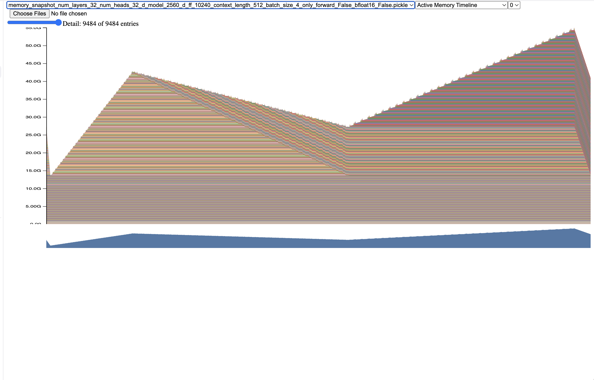
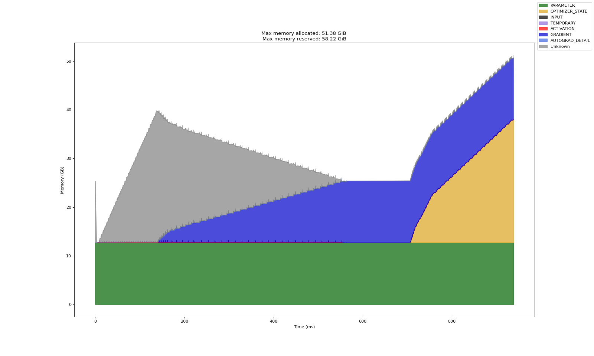
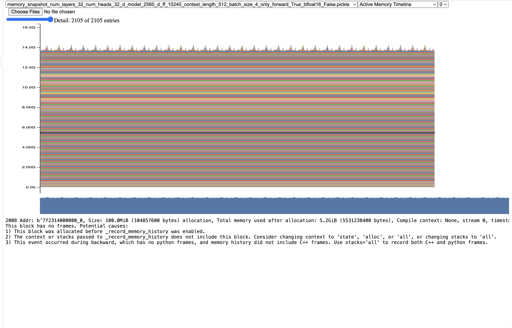
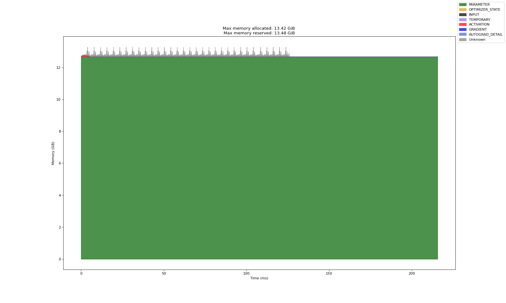

# How to run 

Run the the profiling script [cs336_systems/benchmarking_scripts/memory_profiling.sh](cs336_systems/benchmarking_scripts/memory_profiling.sh), 

```bash
cd cs336_systems/benchmarking_scripts
uv run memory_profiling.sh
```

This will output a tarball of the memory profiling outputs (pickle files and html) to outputs/memory_profiling_<date>_<time>.tar.gz. Then you can untar it and open the html files in your browser / upload the pickle files to [https://docs.pytorch.org/memory_viz](https://docs.pytorch.org/memory_viz)

# Results

> Profile your forward pass, backward pass, and optimizer step of the 2.7B model from Table 1 with context lengths of 128, 256, and 512.

# Question A
> Add an option to your profiling script to run your model through the memory profiler. It may be helpful to reuse some of your previous infrastructure (e.g., to activate mixed-precision, load specific model sizes, etc). Then, run your script to get a memory profile of the 2.7B model when either doing inference only (just forward pass) or a full training step. How do your memory timelines look like? Can you tell which stage is running based on the peaks you see?
> Deliverable: Two images of the “Active memory timeline” of a 2.7B model, from the memory_viz tool: one for the forward pass, and one for running a full training step (forward and backward passes, then optimizer step), and a 2–3 sentence response.

## Forward, backward, optimizer step. 

> Figure 1: Forward, backward, optimizer step. 

> Figure 2: A labeled version of Figure 1. 

1. I have no idea what the first initial spike is. GPT5 claims it's a one-time warmup burst from CUDA. Let's ignore it.
2. Afterwards the forward pass begins. During the forward pass, activations are allocated until we reach the peak.
3. At the top of the peak, we perform the backward pass, layer by layer until the complete gradient is formed.
4. Then the optimizer step starts to take memory.

## Forward only

> Figure 3: Forward only. 

> Figure 4: A labeled version of Figure 4. 

All the memory is taken up by parameters. The reason is that the forward pass immediately frees activation memory (since I put the pass into a no-grad context). You still see tiny peaks of activation memory, but they are quite small. For example, the memory needed to compute an attention score is with context length 512 is 

$$(\text{Batch size}) \cdot (\text{Num heads}) \cdot (\text{Context Length})^2 \cdot \text{(FP32 size)} =  4\cdot 32\cdot 512^2 \cdot 4 B = 128 \text{MB}$$


# Question B
> What is the peak memory usage of each context length when doing a forward pass? What about when doing a full training step?
> Deliverable: A table with two numbers per context length.

| Context Length | Forward Pass | Full Training Step |
|---------------|--------------|---------------------|
| 128           | 12.90 GB     | 51.39 GB            |
| 256           | 13.00 GB     | 51.39 GB            |
| 512           | 13.42 GB     | 51.38 GB            |

This was at first confusing, but I think what's going on is that the activations of the forward pass are freed before the optimizer states are allocated. Thus, although the peaks for activation memory are higher when the context length grows, they're not dominated by the cost of just storing a vector the size of the param 4 times (param, grad, 2 optimizer states).

# Question C
> Find the peak memory usage of the 2.7B model when using mixed-precision, for both a forward pass and a full optimizer step. Does mixed-precision significantly affect memory usage?
> Deliverable: A 2–3 sentence response.

| Context Length | Forward Pass | Full Training Step |
|---------------|--------------|---------------------|
| 128           | 19.18 GB     | 51.39 GB            |
| 256           | 19.24 GB     | 51.39 GB            |
| 512           | 19.38 GB     | 51.38 GB            |

Mixed precision does not significantly affect memory usage for the larger models. For the smaller models, autocast creates a bf16 copy of the float parameters. This adds an extra ~6 GBs of forward passmemory, since the bf16 parameters are 2x smaller than the fp32 parameters. When doing a full training step, the peak memory usage does not change, since again the most expensive part is storing 4 vectors of size ~12 GB.

# Question D
> Consider the 2.7B model. At our reference hyperparameters, what is the size of a tensor of activations in the Transformer residual stream, in single-precision? Give this size in MB (i.e., divide the number of bytes by 1024^2).
> Deliverable: A 1–2 sentence response with your derivation.

I believe they mean the tensor that moves between each layer of the model. This has size

$$
\text{Activation tensor size} = (\text{Batch size}) \cdot (\text{Context Length}) \cdot d_{model} \cdot \text{(FP32 size)} = 4 \cdot T \cdot 2560 \cdot 4 B = \frac{40,960 T}{1024^2} \text{MB} = 0.0390625 T \hspace{10pt} \text{MB}
$$

Thus,

| Context Length | Activation Tensor Size |
|---------------|-------------------------|
| 128           | 5 MB                    |
| 256           | 10 MB                   |
| 512           | 20 MB                   |

Very clean, lol.


# Question E
> Now look closely at the “Active Memory Timeline” from pytorch.org/memory_viz of a memory snapshot of the 2.7B model doing a forward pass. When you reduce the “Detail” level, the tool hides the smallest allocations to the corresponding level (e.g., putting “Detail” at 10% only shows the 10% largest allocations). What is the size of the largest allocations shown? Looking through the stack trace, can you tell where those allocations come from?
> Deliverable: A 1–2 sentence response.